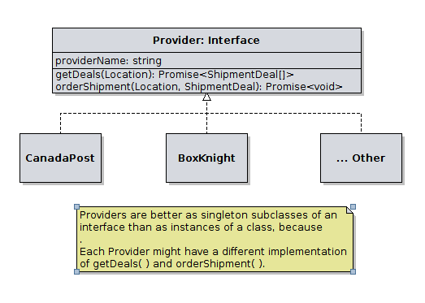

# BoxKnight_InterviewChallenge

## API

```
POST /getBestShippingRate
content-type=application/json

{
    postalCode        : string,
    address_line_one ?: string,
    address_line_two ?: string,
    city             ?: string,
    province         ?: string,
    country          ?: string,
}
```

## ARCH.



pseudo code of `app/app.ts`:

```
deals = flatten(map(providers, p => p.getDeals(destination)))

bestDeal = sortBy(deals, ['price', 'estimate_days'])[0]

respond(bestDeal)

bestProvider = providersByName[ bestDeal.providerName ]
bestProvider.orderShipment(Location, bestDeal);
```
